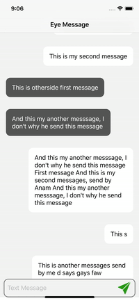

# Eye Message




### A little attempt to clone iMessage in swift 4.2 using  ```UITableView```


## Usage

 ```bash
    clone https://github.com/ranahaani/Eye-Message.git
    cd Eye-Message
    pod install
```


#### Do it programmatically, 100% Pure code, No Storyboard.


## License
[MIT](https://choosealicense.com/licenses/mit/)
